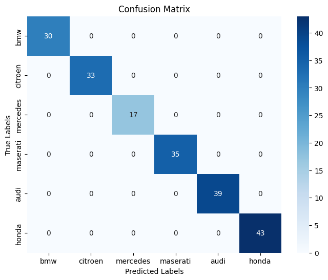
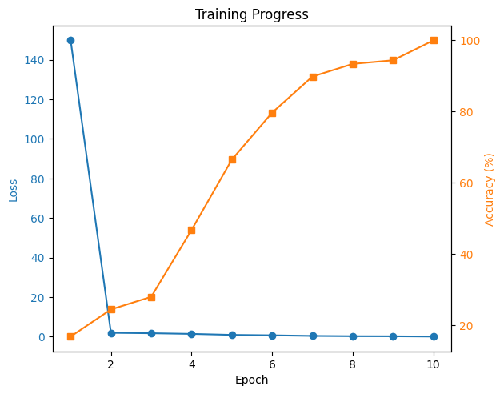

# Car Logo Classifier with PyTorch

This project demonstrates the development of a car brand logo classifier using PyTorch, a popular deep learning framework. The classifier is designed to identify different car brand logos from images that have been preprocessed and labeled accordingly. The project includes a custom neural network architecture and a dataset class to handle data loading and transformation.

## Project Structure

The project is organized into the following components:

1. `CarBrand` Neural Network Model:
    - The `CarBrand` class defines a custom neural network architecture for logo classification.
    - It utilizes Convolutional Neural Networks (CNNs) for feature extraction and fully connected layers for classification.
    - The architecture consists of three convolutional layers followed by max-pooling, and fully connected layers for classification.
    - The final output layer provides brand logo predictions.

2. `CarBrandDataset` Custom Dataset Class:
    - The `CarBrandDataset` class handles loading and preprocessing of the dataset.
    - It reads and processes image and label data from files.
    - Images are converted to grayscale, resized, and transformed using affine transformations.
    - Label information is extracted from XML files associated with the images.

3. Training and Evaluation:
    - The project provides a training script that utilizes the defined neural network and dataset class to train the model.
    - Training hyperparameters, loss function, and optimizer can be configured in the training script.
    - The model's performance can be evaluated using accuracy and other relevant metrics.
    - 
    - 


## Usage

1. Clone the Repository:
   ```bash
   git clone https://github.com/g-hano/Car-Logo-Detection-with-PyTorch.git
   ```

2. Dataset Preparation:
   - Collect labeled images of car brand logos.
   - Organize the dataset directory with images and corresponding XML files (containing label information).

3. Install Dependencies:
   - Install the required dependencies using the following command:
   ```bash
   pip install -r requirements.txt
   ```


   - Use the trained model for inference on new images:
   ```python
   from CarBrand import CarBrand
   from torchvision.transforms import ToTensor

   model = CarBrand(num_classes=6)
   model.load_state_dict(torch.load('path_to_checkpoint.pth'))
   model.eval()

   image = Image.open('path_to_image.jpg').convert('L')  # Load and preprocess the image
   transform = ToTensor()
   image_tensor = transform(image).unsqueeze(0)

   with torch.no_grad():
       predictions = model(image_tensor)
   ```

## Customization and Extensions

- You can customize the neural network architecture by modifying the `CarBrand` class.
- Adjust preprocessing steps and data augmentation techniques in the `CarBrandDataset` class.
- Experiment with different hyperparameters, loss functions, and optimizers to improve model performance.
- Extend the dataset and model for multi-class classification beyond the defined car brand labels.

## Acknowledgments

This project is inspired by the need to classify car brand logos and demonstrates the utilization of PyTorch for building and training neural network models. It combines computer vision techniques, deep learning, and data preprocessing to achieve accurate logo classification.

## License

This project is licensed under the MIT License - see the [LICENSE](LICENSE) file for details.

---
